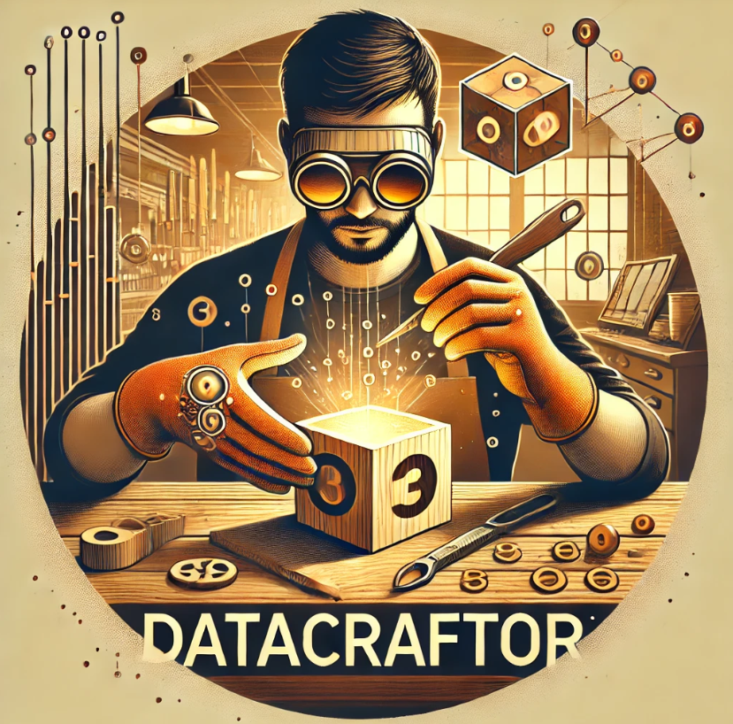

# Aaron Thomas Mathew's Data Science Portfolio

Welcome! I’m Aaron Thomas Mathew, an AIML enthusiast with a strong passion for Machine Learning, Deep Learning, and Natural Language Processing. This portfolio highlights select projects that demonstrate my journey and expertise in data science and AI.
## Education
- **B.Tech in Computer Science Engineering with a specialization in AIML** | PES University

## Projects

### 1. Synthetic Dataset Generator with Prompt-Based System
{: width="400" }

Created **DataCraftor**, a Gradio-based application that generates synthetic datasets using structured prompts. This tool allows users to create datasets tailored to specific requirements, making it versatile for various machine learning applications. The system leverages an **LLM** to generate and organize data based on input prompts.  
**[Explore it on Hugging Face Spaces](https://huggingface.co/spaces/aaronmat1905/DataCraftor)**

### 2. OCR Model for Handwritten Text Recognition
Developed and trained a deep learning model for **handwritten text recognition** using **TensorFlow**. This OCR model achieves high accuracy on custom datasets, facilitating the digitization of handwritten notes and documents.

### 3. Virtual Assistant with Emotion and Gesture Recognition
Designed an interactive **virtual assistant** featuring emotion detection, hand gesture recognition, depth mapping, and image captioning. Integrated **NLP** and **computer vision** models to create a responsive user experience that interprets user inputs in real-time.

## Skills
- **Programming Languages**: Python, C
- **Core Expertise**: **Natural Language Processing (NLP)**, **LLM Engineering**, **Generative AI with LLMs**

## Contact
- **LinkedIn**: [linkedin.com/in/aarontm19](https://www.linkedin.com/in/aarontm19)
